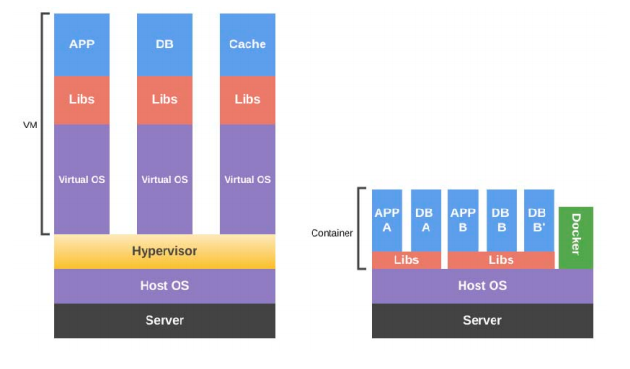

## Introduction

> Docker is a set of platform as a service (PaaS) products that use OS-level virtualization to deliver software in packages called containers. Containers are isolated from one another and bundle their own software, libraries and configuration files; they can communicate with each other through well-defined channels. All containers are run by a single operating system kernel and therefore use fewer resources than virtual machines.

### Container vs VM

In short, containers are lighter, as they do not need a complete virtual environment, as the host kernel provides full memory management, I / O, CPU etc. This means that the total process startup may take a few seconds.

### Namespaces

Namespaces creates an isolation layer for groups of processes.

* pid - process isolation (PID);

* net - control of network interfaces;

* ipc - control of IPC resources (InterProcess Communication);

* mnt - management of assembly points;

* uts - UTS (Unix Timesharing System) isolate kernel resources;

### Cgroups

Cgroups allows Docker to share data hardware resources on the host with the containers and, if necessary, you can set usage limits and some restrictions.

### Union Files Systems

Union file systems (or UnionFS) are file systems that work through creating layers. They are light and very fast. Docker uses layered file systems to build images that will be used in the creation of containers.

### Hello, Docker!

* $ sudo docker run ubuntu /bin/echo Hello, Docker!

### 

*  $ sudo docker ps - checks for running containers.

* sudo docker run ‐i ‐t ubuntu /bin/bash - create one container and access its interactive shell

‐i tells Docker that we want to have interactivity with the container, and the –t that we want to link to the container terminal. In then we inform the name of the image used, in the case of Ubuntu, and we pass the / bin / bash command as an argument.

